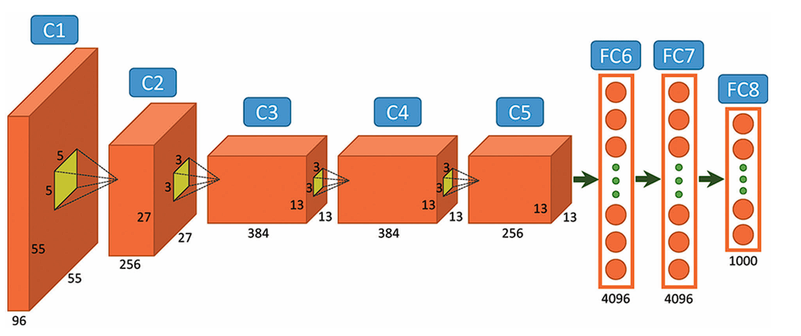

# CS485: GPU Cluster Programming (MPI+CUDA) – Final Project: AlexNet Inference

This directory contains the code, documentation, and resources for the final project of the CS485 GPU Cluster Programming course: an evolving MPI+CUDA implementation of AlexNet inference. The project follows a staged development approach, progressing from serial execution to advanced hybrid parallelism.

**Project Scope Clarification:** The primary focus of the V1-V5 implementation plan is on the **initial two blocks** of the AlexNet architecture (Conv1->ReLU->Pool1 and Conv2->ReLU->Pool2->LRN2). This provides a representative and computationally significant workload for learning and comparing parallelization techniques (MPI, CUDA, Hybrid). Implementing the *full* AlexNet network (including Conv3-5, FC6-8, Softmax) is considered an extension task to be undertaken only *after* the successful completion and analysis of V1-V5 for the initial subset, if time permits.



## Table of Contents
1.  [Project Overview](#1-project-overview)
2.  [Target Environment](#2-target-environment)
3.  [Repository Structure (This Directory)](#3-repository-structure-this-directory)
4.  [Project Version Implementation Plan (Blocks 1 & 2 Focus)](#4-project-version-implementation-plan-blocks-1--2-focus)
    *   [Version 1: Serial CPU](#version-1-serial-cpu---completed)
    *   [Version 2: MPI Only (CPU)](#version-2-mpi-only-cpu---completed)
        *   [Approach 2.1: Broadcast All](#approach-21-broadcast-all---implemented)
        *   [Approach 2.2: Scatter + Halo](#approach-22-scatter--halo---implemented)
    *   [Version 3: CUDA Only (Single GPU)](#version-3-cuda-only-single-gpu---completed)
    *   [Version 4: MPI + CUDA (Hybrid)](#version-4-mpi--cuda-hybrid---implemented-debugging)
    *   [Version 5: CUDA-Aware MPI (Optional Optimization)](#version-5-cuda-aware-mpi-optional-optimization---pending)
5.  [Key Technologies](#5-key-technologies)
6.  [Current Implementation Status & Performance Highlights](#6-current-implementation-status--performance-highlights)
7.  [Development Workflow for Versions](#7-development-workflow-for-versions)
8.  [Build & Test Instructions per Version](#8-build--test-instructions-per-version)
9.  [Presentation Strategy](#9-presentation-strategy)
10. [Troubleshooting](#10-troubleshooting)
11. [Future Directions & Extensions](#11-future-directions--extensions)
12. [References & Resources](#12-references--resources)

## 1. Project Overview
This project implements inference for the **initial two blocks** of the AlexNet convolutional neural network (Conv1->ReLU->Pool1 and Conv2->ReLU->Pool2->LRN2). The primary goal is to learn and apply different parallel programming paradigms (MPI, CUDA, MPI+CUDA) to this representative workload and to systematically evaluate their performance impact through a structured, incremental 5-version approach. The focus is on the parallelization techniques and performance analysis, rather than building a complete end-to-end classifier.

**Core Task:** Implement and benchmark inference for AlexNet Blocks 1 & 2 across different parallelization stages (V1-V5).

**Parallelization Strategy (V4/V5):** Primarily data parallelism. Input data rows are distributed across MPI ranks (Scatter+Halo).
*   **V4 Approach:** Each rank performs MPI halo exchange using host buffers, copies its padded data tile to the GPU, executes the *entire* V3 CUDA layer sequence on that tile using a helper function (`alexnetTileForwardCUDA`), copies the result tile back to the host, and trims halo-related rows on the host before the final MPI gather.
*   **V5 Approach (Planned):** Optimize V4 using CUDA-aware MPI calls to potentially eliminate explicit host staging for MPI communication.

## 2. Target Environment
Code must ultimately compile and run correctly under the course's specified environment:
- **OS:** Fedora 37
- **Compilers:** GCC 12 (for host code), `mpicc`/`mpicxx` (MPI wrappers), `nvcc` (CUDA compiler)
- **GPU Toolkit:** CUDA 12.x
- **MPI:** Open MPI (ideally compiled with CUDA-awareness for V5)

Local development is done in WSL2 (Ubuntu) with compatible toolchains, but final testing should target the Fedora environment.

## 3. Repository Structure (This Directory)

```
final_project/
├── v1_serial/ # V1: Serial CPU implementation (COMPLETE)
│ ├── include/
│ ├── src/
│ └── Makefile
├── v2_mpi_only/ # V2: MPI-only (CPU cores) implementation (COMPLETE)
│ ├── 2.1_broadcast_all/ # -> Approach 2.1 (Implemented)
│ │ ├── include/
│ │ ├── src/
│ │ └── Makefile
│ └── 2.2_scatter_halo/ # -> Approach 2.2 (Implemented)
│ ├── include/
│ ├── src/
│ └── Makefile
├── v3_cuda_only/ # V3: CUDA-only (single GPU) implementation (COMPLETE)
│ ├── include/
│ ├── src/
│ └── Makefile
├── v4_mpi_cuda/ # V4: Baseline MPI + CUDA implementation (IMPLEMENTED - DEBUGGING)
│ ├── include/
│ ├── src/
│ └── Makefile
├── v5_cuda_aware_mpi/ # V5: Optional CUDA-aware MPI optimization (PENDING - Baseline Code)
│ ├── include/
│ ├── src/
│ └── Makefile
├── data/ # SHARED: Input data, model weights, etc. (Accessed via ../data/ or ../../data/)
├── docs/ # SHARED: Project documentation, design notes (Accessed via ../docs/ or ../../docs/)
├── logs/ # Basic run logs (gitignored)
├── logs_extended/ # Detailed performance logs (gitignored)
├── ai_context.txt # Technical context summary for AI assistant
├── discussion.md # Rolling log for professor meetings
├── project.txt # Concatenated source code dump (generated by script)
├── RESEARCH.md # Research findings, critical analysis, references
└── README.md # This file
```

**Note:** Shared resources (`data/`, `docs/`) are accessed from within versioned source code using relative paths. Adjust paths depending on whether accessing from `vX/` or `v2_mpi_only/X.Y/`.

## 4. Project Version Implementation Plan (Blocks 1 & 2 Focus)

The project progresses through five versions, focusing on Blocks 1&2 of AlexNet. V2 explored two distinct MPI strategies. The core goal is to demonstrate understanding of each parallelization paradigm using this subset.

---
### Version 1: Serial CPU - COMPLETED
*   **Directory:** `final_project/v1_serial/`
*   **Goal:** Correct, sequential implementation on a single CPU core. Established functional baseline.
*   **Implementation:** Pure C++, `std::vector`, direct loops for layers.

---
### Version 2: MPI Only (CPU) - COMPLETED
*   **Goal:** Parallelize V1 logic across multiple CPU cores using MPI.
*   **Directory Structure:** Contains subdirectories for implemented approaches.

#### Approach 2.1: Broadcast All - IMPLEMENTED
*   **Directory:** `final_project/v2_mpi_only/2.1_broadcast_all/`
*   **Strategy:** Rank 0 `MPI_Bcast`s full input/parameters. All ranks compute the full V1 layer sequence locally. Each rank extracts its assigned slice from the *final* output only. Rank 0 gathers slices via `MPI_Gatherv`.
*   **Outcome:** Simple implementation, validated basic MPI communication, but demonstrated poor scalability due to broadcast overhead and redundant computation. Serves as a contrast to more scalable methods.

#### Approach 2.2: Scatter + Halo - IMPLEMENTED
*   **Directory:** `final_project/v2_mpi_only/2.2_scatter_halo/`
*   **Strategy:** Rank 0 `MPI_Scatterv`s input rows. Ranks exchange halo regions using non-blocking `MPI_Isend`/`MPI_Irecv`/`MPI_Wait` before convolution layers (specifically V2 implementation handled halos before each block needing them). Parameters are broadcast. Each rank computes only on its local data (+halos). Rank 0 gathers final results via `MPI_Gatherv`. Required careful index management and handling of boundary conditions/padding, including asymmetric trimming after pooling.
*   **Outcome:** More complex implementation, but demonstrated expected speedup and better scalability compared to 2.1. Represents a more realistic MPI parallelization pattern for convolutions.

---
### Version 3: CUDA Only (Single GPU) - COMPLETED
*   **Directory:** `final_project/v3_cuda_only/`
*   **Goal:** Port V1 compute logic (layers) to run on a single GPU using CUDA. Establish GPU baseline performance.
*   **Implementation:** Basic CUDA kernels implemented for Conv, ReLU, Pool, LRN (e.g., 1D grid-stride loops). Host code manages `cudaMalloc`/`cudaMemcpy`/`cudaFree`, kernel launches. Basic `CUDA_CHECK` error handling used. Uses `nvcc` compiler.
*   **Outcome:** Functional GPU implementation. Initial performance analysis indicates potential bottlenecks likely related to host-device transfer overhead or unoptimized kernels (requires profiling). Sample output values differ from V1/V2, needing investigation.

---
### Version 4: MPI + CUDA (Hybrid) - IMPLEMENTED (Debugging)
*   **Directory:** `final_project/v4_mpi_cuda/`
*   **Goal:** Combine MPI parallelism (inter-rank, based on V2.2 Scatter+Halo logic) with CUDA parallelism (intra-rank GPU kernel execution from V3).
*   **Implementation Status:** Code implemented but requires debugging.
*   **Current Strategy Implemented:**
    1.  MPI Setup: Ranks initialize, parameters broadcast, input data rows scattered via `MPI_Scatterv` to host buffers.
    2.  Host Halo Exchange: Halo regions for Conv1 are exchanged between ranks using `MPI_Isend`/`Irecv`/`Wait` on host buffers.
    3.  Host->Device Copy: The *padded* local input slice (local rows + received halos) is copied to the GPU (`cudaMemcpyHostToDevice`).
    4.  GPU Computation: A single helper function (`alexnetTileForwardCUDA`) executes the *entire* V3 layer sequence (Conv1->...->LRN2) on the GPU for the padded tile. Intermediate layer results stay on the GPU within this function.
    5.  Device->Host Copy: The final output tile (corresponding to the padded input) is copied back to the host (`cudaMemcpyDeviceToHost`).
    6.  Host Trimming: Rows corresponding to the initial halo padding are trimmed from the host result buffer based on rank (simplified logic currently used).
    7.  Result Aggregation: Trimmed local results are gathered via `MPI_Gatherv` to rank 0.
    8.  GPU Affinity: `cudaSetDevice` is used based on MPI rank.
    9.  Build: Uses `nvcc -ccbin=mpicxx`.
*   **Issues:**
    *   Output format mismatch prevents automatic result parsing by test script.
    *   Runtime error occurs when running with 4 processes (exit code 134).
    *   Correctness of trimming logic and overall numerical output needs verification.
*   **Alternative Path:** An unused function (`alexnetForwardPassMPI_CUDA`) exists with more complex trimming logic, suggesting a potential refinement path.

---
### Version 5: CUDA-Aware MPI (Optional Optimization) - PENDING
*   **Directory:** `final_project/v5_cuda_aware_mpi/`
*   **Goal:** Optimize V4 by using CUDA-aware MPI calls (passing GPU device pointers directly to MPI) to potentially reduce/eliminate host staging overhead *for MPI communication*.
*   **Planned Actions:**
    1.  Modify V4 code's `MPI_Scatterv`, `MPI_Isend`, `MPI_Irecv`, `MPI_Gatherv` calls to use *device* pointers.
    2.  Remove explicit H<->D `cudaMemcpy` calls related solely to MPI staging (copies for padding/trimming might still be needed depending on approach).
    3.  Verify cluster support (CUDA-aware OpenMPI build, HW support like GPUDirect RDMA). Configure environment if needed.
    4.  Compare performance against V4 to quantify benefit/overhead.
    5.  Build with `nvcc -ccbin=mpicxx`.

## 5. Key Technologies
- **MPI (Open MPI):** Distributed memory communication.
- **CUDA (NVIDIA):** GPU programming (`nvcc`, runtime API, kernels).
- **C++11/17:** Host code logic, `std::vector`.
- **Make:** Build system (including `bear` and `clang-tidy` integration in V4).
- **Bash:** Automation scripts (testing, packaging).

## 6. Current Implementation Status & Performance Highlights

*(Based on `run_final_project.sh` output on WSL2 dev machine - Times approximate, relative scaling is key)*

| Version                | Procs | Shape     | First 5 Vals (Sample)          | Time       | Status | Notes                                      |
| :--------------------- | :---- | :-------- | :----------------------------- | :--------- | :----- | :----------------------------------------- |
| V1 Serial              | 1     | 13x13x256 | `0.0653 0.0579 0.0668 ...`     | ~667 ms    | ✔      | Baseline                                   |
| V2 2.1-broadcast-all | 1     | 13x13x256 | `44.4152 42.4612 40.6967 ...` | ~679 ms    | ✔      |                                            |
| V2 2.1-broadcast-all | 2     | 13x13x256 | `44.4152 42.4612 40.6967 ...` | ~809 ms    | ✔      | Scalability issue                          |
| V2 2.1-broadcast-all | 4     | 13x13x256 | `44.4152 42.4612 40.6967 ...` | ~881 ms    | ✔      | Degrades                                   |
| V2 2.2-scatter-halo  | 1     | 13x13x256 | `44.4152 42.4612 40.6967 ...` | ~561 ms    | ✔      |                                            |
| V2 2.2-scatter-halo  | 2     | 13x13x256 | `29.2981 28.7552 28.2351 ...` | ~343 ms    | ✔      | Speedup                                    |
| V2 2.2-scatter-halo  | 4     | 13x13x256 | `29.2981 28.7552 28.2351 ...` | ~281 ms    | ✔      | Good scaling                               |
| V3 CUDA                | 1     | 13x13x256 | `29.2932 25.9153 23.3255 ...` | ~2349 ms   | ✔      | Slower than serial; needs profiling        |
| V4 MPI+CUDA          | 1     | –         | –                              | –          | ⚠      | Runs; Output format mismatch               |
| V4 MPI+CUDA          | 2     | –         | –                              | –          | ⚠      | Runs; Output format mismatch               |
| V4 MPI+CUDA          | 4     | –         | –                              | –          | ⚠      | Fails (Exit 134 - MPI/Resource issue?)     |
| V5 CUDA-Aware        | -     | -         | -                              | -          | (PENDING) |                                            |

**Observations:**
*   V2.2 shows expected MPI speedup. V2.1 shows expected overhead penalty.
*   V3 (CUDA) is currently slower than V1 (Serial), indicating significant overhead or unoptimized kernels. Profiling needed.
*   V4 runs for NP=1,2 but results aren't parsed due to output format differences. NP=4 fails during runtime. **V4 needs debugging.**
*   Sample output values differ significantly between V1, V2.1, V2.2(np>=2), and V3, suggesting potential numerical differences or initialization variations that need investigation for correctness.

## 7. Development Workflow for Versions
1.  **Choose Version/Approach:** Select the target (e.g., Debug V4, Implement V5).
2.  **Navigate:** `cd final_project/vX_suffix[/Y.Z_approach]`
3.  **Implement/Debug:** Modify code in `src/` and `include/` based on the version's goal.
4.  **Update Makefile:** Adjust compiler, flags, libraries, sources if needed.
5.  **Build:** Run `make clean && make` (or `make compile_commands && make build_only` for V4+).
6.  **Test:** Execute the compiled `template` executable using appropriate command (serial/MPI). Use `run_final_project.sh` for automated testing.
7.  **Analyze/Profile:** Use timers (`MPI_Wtime`, CUDA Events), log files, debuggers (GDB, `cuda-gdb`), and profilers (Nsight Systems/Compute) to understand performance and correctness.
8.  **Commit:** Save changes frequently using Git.

## 8. Build & Test Instructions per Version

**(Run commands from within the respective subdirectory)**

*   **V1 (Serial):** `make clean && make && ./template`
*   **V2 (MPI - Broadcast All):** `make clean && make && mpirun -np <N> ./template`
*   **V2 (MPI - Scatter+Halo):** `make clean && make && mpirun -np <N> ./template`
*   **V3 (CUDA Only):** `make clean && make && ./template`
*   **V4 (MPI+CUDA):** `make clean && make && mpirun -np <N> ./template` (Use `make lint` for checks)
*   **V5 (CUDA-Aware MPI):** `make clean && make && mpirun -np <N> ./template` *(Requires correctly configured CUDA-aware MPI environment)*

*(Use `--oversubscribe` for `mpirun` if testing locally with N > physical cores. On cluster, use `-hostfile` and mapping options.)*
*Use `../../scripts/run_final_project.sh` from the repo root to run all versions and generate the summary table.*

## 9. Presentation Strategy

The final project presentation will focus on the **journey of parallelization and performance analysis using the first two blocks of AlexNet** as the consistent workload. Key elements will include:
*   **Demonstration:** Show V1-V4 (or highest working version) running. Explain V4 debugging status.
*   **Methodology:** Explain the parallelization techniques applied in each distinct version (Serial, MPI Broadcast, MPI Scatter+Halo, CUDA, MPI+CUDA Host-Staging). Justify design choices (e.g., V4's full-tile-on-GPU approach).
*   **Performance Analysis:** Present comprehensive results from the target cluster:
    *   Wall-clock times for each version (using corrected V4 results).
    *   Speedup and Efficiency plots relative to V1.
    *   Scalability analysis (strong scaling) for MPI/Hybrid versions (V2.x, V4).
    *   Timing breakdowns (computation vs communication vs H<->D transfer) using profiler data (especially for V3/V4) to identify bottlenecks.
    *   Discuss observed numerical differences if they persist.
*   **Conclusion:** Summarize key learnings, challenges overcome (including V4 debugging), and the effectiveness of each parallelization approach for this specific workload.

## 10. Troubleshooting
- Makefile Errors: Check TABs vs spaces, variable names, paths, dependencies. Run `make -d` for debug info. For V4, ensure `bear` is installed if using `make compile_commands`.
- Include Errors: Verify include paths (`-I`), header guards (`#pragma once` or `#ifndef`).
- Linker Errors: Check linked libraries (`-l`), library paths (`-L`), ensure all object files are included, check for symbol mismatches (`nm object.o`). For V4/V5, ensure MPI/CUDA libs are linked correctly via `nvcc -ccbin=mpicxx`.
- MPI Runtime Errors: Check `mpirun` syntax (`-np`, `--oversubscribe`, hostfile). Check for deadlocks (mismatched send/recv tags, collective calls). Check buffer sizes/counts. Use `MPI_Abort` with error codes. Examine log files from test script.
- CUDA Errors: Use `CUDA_CHECK` macro around *all* runtime API calls and after kernel launches (`cudaGetLastError`). Use `cuda-memcheck` or `compute-sanitizer` to detect memory errors. Check kernel launch configurations (grid/block dims). Ensure correct device is set (`cudaSetDevice`).
- Path Errors: Double-check relative paths (`../`, `./`) used for includes or data access.
- V4 Runtime Error (NP=4): Examine `final_project/logs/final_project_v4_np4.log` first. Re-run with `-g`, potentially under `gdb --args mpirun -np 4 ./template`, or use `cuda-memcheck mpirun -np 4 ./template`. Check resource limits (memory, GPU access per node).

## 11. Future Directions & Extensions
- **Debug & Validate V4:** Fix output format, resolve NP=4 runtime error, verify numerical correctness and trimming logic against V1/V3.
- **Profile V3 & V4:** Use Nsight Systems/Compute to understand V3 slowness and identify V4 bottlenecks (likely H<->D copies, host halo exchange).
- **Implement V5:** If V4 is stable and cluster supports it, implement CUDA-aware MPI optimization and benchmark against V4.
- **Performance Optimization:** Apply techniques based on profiling (e.g., async overlap in V4/V5, kernel tuning).
- **Full AlexNet Implementation:** *If time permits after V1-V5*, extend the most performant version to include remaining layers.
- **Explore Alternative V4 Strategy:** Consider refactoring V4 to use the more complex logic in the unused `alexnetForwardPassMPI_CUDA` function for potentially finer-grained control or different performance characteristics.

## 12. References & Resources
- MPI Forum: [mpi-forum.org](https://mpi-forum.org/)
- NVIDIA CUDA Documentation: [docs.nvidia.com/cuda/](https://docs.nvidia.com/cuda/)
- Programming Massively Parallel Processors (4th Ed.) Textbook & Companion Site
- Open MPI Documentation: [open-mpi.org](https://www.open-mpi.org/)
- LLNL HPC Tutorials: [hpc-tutorials.llnl.gov](https://hpc-tutorials.llnl.gov/)
- `final_project/RESEARCH.md` for detailed analysis and specific paper references.
