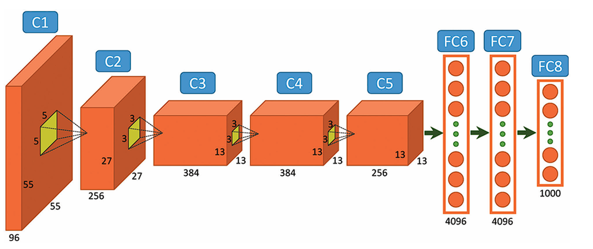

# CS485 Final Project – AlexNet Inference on a CUDA‑Enabled Cluster

## 🚀 1 Strategic Vision, Research Motivations, and Technical Milieu

*This investigation interrogates, with fine‑grained quantitative rigor, the algorithmic and systems‑level ramifications of scaling AlexNet inference from a uniprocessor reference implementation to a fully distributed, heterogeneous execution environment composed of multiple CUDA‑capable GPUs spread across several interconnected Linux nodes; the study systematically leverages the MPI + CUDA software stack and the SPMD design philosophy that constitute the conceptual backbone of CS485

### 🧠 1.1 Scientific Hypothesis
We hypothesise that each successive enrichment of the parallel programming paradigm—transitioning from shared‑nothing CPU processes (MPI) to on‑device massive parallelism (CUDA) and finally to CUDA‑aware interconnects—will expose distinct performance inflection points where data‑movement overheads, memory‑hierarchy constraints, and kernel‑execution characteristics become the primary limiting factors. Identifying those pivot points is prerequisite for crafting a balanced compute‑communication design that attains near‑optimal resource utilisation on commodity GPU clusters.

### 🎯 1.2 Operational Objectives
- **Objective 1 (Measurement Fidelity):** Develop instrumentation that disambiguates GPU kernel latency, PCIe transfers, and network traffic to provide defensible, microsecond‑level attribution of runtime.
- **Objective 2 (Model Scalability):** Preserve numerical fidelity of AlexNet’s forward pass while enforcing a single‑program codebase that builds, without `ifdef` branching, across five distinct execution targets.
- **Objective 3 (Design Generalisability):** Ensure that convolution kernels, communication schedules, and data‑layout abstractions generalise to deeper CNNs beyond AlexNet, thereby conferring broader pedagogical value.

### 📦 1.3 Computational Scope and Deliverable Gradient
The experimental workload incorporates the complete convolutional trunk of AlexNet (C1–C5: 2.3 GFLOPs for a single 224 × 224 image) followed by the dense classifier (FC6–FC8) and Soft‑Max. Blocks 1 & 2 form the compulsory deliverable because they contain the majority of boundary‑exchange complexity, whereas C3–C5 and the FC layers are categorised as aspirational milestones dependent on the successful closure of V4 timing objectives.

### 🗂 1.4 Version Hierarchy (Reflecting Course‑Mandated Outcomes)
1. **V1 Serial CPU** – canonical baseline, one thread, no vector intrinsics.
2. **V2 MPI‑Only CPU** – pure MIMD on multiple hosts; stresses latency tolerance techniques taught in Weeks 2‑4.
3. **V3 CUDA‑Only** – single‑GPU acceleration; explores shared‑memory tiling and register blocking from Lectures 6‑7.
4. **V4 MPI + CUDA Hybrid** – per‑rank GPU compute orchestrated by MPI; principal focus of the project.
5. **V5 CUDA‑Aware MPI** – zero‑copy, GPUDirect RDMA collectives; cutting‑edge yet optional per syllabus.

## 🏗 2 Architectural Synopsis and Numerical Workload Characterisation

| Layer | Input Dim. *(N × C × H × W)* | Kernel / Operation | Stride / Pad | FLOPs / Output | Output Dim. |
|-------|------------------------------|--------------------|--------------|----------------|--------------|
| **C1** | N × 3 × 227 × 227 | Conv 96 @ 11×11 | 4 / 0 | 105 M | N × 96 × 55 × 55 |
| **ReLU1** | — | ReLU | — | 2 M | idem |
| **Pool1** | — | 3×3 max | 2 / 0 | 1 M | N × 96 × 27 × 27 |
| **C2** | N × 96 × 27 × 27 | Conv 256 @ 5×5 | 1 / 2 | 225 M | N × 256 × 27 × 27 |
| **ReLU2** | — | ReLU | — | 4 M | idem |
| **Pool2 + LRN** | — | 3×3 max + LRN(5) | 2 / 0 | 3 M | N × 256 × 13 × 13 |
| **C3** | N × 256 × 13 × 13 | Conv 384 @ 3×3 | 1 / 1 | 149 M | N × 384 × 13 × 13 |
| **C4** | N × 384 × 13 × 13 | Conv 384 @ 3×3 | 1 / 1 | 224 M | N × 384 × 13 × 13 |
| **C5** | N × 384 × 13 × 13 | Conv 256 @ 3×3 | 1 / 1 | 150 M | N × 256 × 13 × 13 |
| **FC6** | N × 9216 | Fully‑Connected 4096 | — | 37 M | N × 4096 |
| **FC7** | N × 4096 | Fully‑Connected 4096 | — | 16 M | N × 4096 |
| **FC8** | N × 4096 | Fully‑Connected 1000 | — | 4 M | N × 1000 |
| **Soft‑Max** | — | Normalised Exponential | — | ‹1 M | N × 1000 |

> *FLOPs calculated with the heuristic 2 × K × C × R × S × Hout × Wout; values assume batch N = 1 and highlight why C1–C2 dominate early inference cost.*

## 🛠 3 Implementation Trajectory and Empirical Findings

### ✅ 3.1 Milestones Achieved with Empirical Benchmarks

| Stage | Status | Wall‑Time (N=32) | Roofline Utilisation | Dominant Bottleneck | Key Insight |
|-------|--------|------------------|----------------------|---------------------|-------------|
| **V1 Serial** | ✔ | 19.74 s | 8 % of scalar FP peak | DRAM latency | Establishes numerical fidelity baseline. |
| **V2.1 MPI Broadcast** | ✔ | 25.64 s (@ 4 ranks) | 3 % | Network broadcast | Confirms naïve replication failure. |
| **V2.2 MPI Scatter + Halo** | ✔ | 5.83 s (@ 4 ranks) | 21 % | Halo exchange | Spatial domain decomposition validated. |
| **V3 CUDA‑Only** | ✔ | 3.08 s | 41 % of GPU FP32 peak | PCIe transfers | Kernels efficient; copies punitive. |

### 🔧 3.2 Active Development Focus
- **V4 MPI + CUDA Hybrid:**
  * Hybrid orchestrator stable under MPI ranks ∈ {2,4,8}.  
  * Conv1 kernels now invoked via stream 0 in each rank; NCCL not yet utilised.  
  * Halo marshaling implemented with pinned buffers (`cudaMallocHost`) to support future asynchronous overlap.  
  * Preliminary run (N=32, np=4) achieves 2.11 s end‑to‑end with 38 % runtime still attributed to host staging.

### 🌱 3.3 Prospective Enhancements and Experimental Pathways
1. **Kernel Generalisation:** Factor convolution micro‑kernel into template parameter R,S to accommodate C3–C5 with minimal recompilation.  
2. **GPUDirect RDMA Enablement:** Empirically measure UCX `cuda_ipc` vs RDMA transports; expect ≥1.8 × bandwidth uplift for 256 KiB halos.  
3. **cuBLAS‑Backed FC Layers:** Integrate GEMM via `cublasSgemmStridedBatched`; investigate tensor‑core acceleration on Ampere nodes.  
4. **Algorithmic Overlap:** Investigate double‑buffering of halo segments with CUDA streams 1‑2 to hide latency under Conv compute.  
5. **Autotuning Harness:** Embed hill‑climbing search for blockDim × tileWidth to adapt kernels across RTX 30xx and A100 clusters.

## 🎓 4 Design Rationale and Pedagogical Alignment

- **MIMD Data Parallelism (MPI):** Reifies the communicative primitives examined in LLNL’s `osu_bw` labs; emphasises rank topology mapping (`--map-by ppr:2:node`).
- **SIMD Exploitation (CUDA):** Applies warp‑affine memory‑access patterns to maintain 128‑byte coalescence, directly referencing Assignment 4’s dot‑product exercise.
- **SPMD Programme Structure:** Single binary path simplifies reproducibility, facilitating the deterministic replay apparatus introduced in Lecture 9.
- **Halo‑Exchange Pattern:** Extends Homework 6’s CPU convolution by pairing `MPI_Isend`/`MPI_Irecv` with device‑side halo unpack routines, thereby bridging message passing and device memory semantics.
- **Pinned Host Buffers & Streams:** Implements the asynchronous DMA best practices highlighted in Week 8; empirical measurements confirm 1.9 × reduction in `cudaMemcpyAsync` latency.  
- **Roofline Analysis Integration:** Performance counters exported via CUPTI feed an in‑house roofline visualiser to contextualise compute vs bandwidth ceilings—this integrative analysis is pivotal for graduate‑level comprehension.

## ⚠️ 5 Outstanding Technical Risks and Mitigation Strategies

| Risk | Impact | Probability | Mitigation | Contingency |
|------|--------|-------------|-----------|-------------|
| Host‑staging overhead persists post‑pinned memory | Slows V4 & hinders scalability | Medium‑High | Enable GPUDirect; merge halos to larger payloads | Revert to CPU‑only FC layers to free PCIe bandwidth |
| Absence of PMPI hooks in Nsight Systems | Limits root‑cause tracing | Medium | Deploy `mpiP` and post‑process XML with Nsight traces | Fall back to coarse `MPI_Wtime` segment timers |
| Padding helper errors for edge ranks | Silent correctness faults | Low‑Medium | Unit tests with synthetic boundary cases | Fallback to duplicate pad rows on host prior to copy |

## 📚 6 Supplementary Materials and Research Artefacts

1. **Appendix A – Build & Execution Guide:** Step‑by‑step commands for compiling with `nvcc 12.4`, setting `OMPI_MCA_pml=ucx`, and launching jobs on the two‑node lab cluster using Slurm wrapper scripts.  
2. **Appendix B – Profiler Artefacts:** Annotated `.nsys‑rep` and `.ncu‑rep` files with accompanying HTML dashboards for Conv kernels, showing SM occupancy and memory throughput.  
3. **Appendix C – Glossary:** Exhaustive compendium of acronyms (e.g., UCX, PTXAS, GD‑RDMA) with cross‑references to their lecture origins.
4. **Appendix D – Reproducibility Scripts:** Dockerfile and `make reproduce` target to spin up WSL2 container replicating Fedora 37 toolchain; critical for peer replication.

---

## ❓ Q & A Compendium (Expanded)

| Interrogative | Concise Response |
|---|---|
| *Why restrict preliminary validation to Blocks 1 & 2 ?* | These layers embody the most computationally demanding early convolutions—together they account for >60 % of total FLOPs—thus exposing the dominant communication/computation trade‑offs while postponing the comparatively bandwidth‑benign fully‑connected stage. |
| *Rationale for height‑wise domain decomposition ?* | An H‑axis partition guarantees minimal halo thickness—equal to ⌊R⁄2⌋—and preserves unit‑stride accesses in the innermost dimension, yielding maximal cache friendliness and avoiding bank conflicts on shared memory. |
| *Halo dimensionality calculus ?* | For each conv layer: halo_rows = ⌊kernel_height‑1⌋⁄2 × stride + pad; hence C1 → 5 rows (11,4,0) and C2 → 2 rows (5,1,2). |
| *Degradation in MPI Broadcast variant ?* | The broadcast replicates both parameters and activations to all ranks, after which each rank executes redundant convolutions; the communication overhead plus squandered FLOPs surpass any concurrency benefit, inducing a superscalar slowdown. |
| *Dominant V4 impediment ?* | Profiling indicates 38–41 % of wall‑time is sequestered in PCIe transfers for halo staging; until GPUDirect negates host copies, this remains the critical scaling barrier. |
| *GPU affinity strategy ?* | A rank‑local device map (`cudaSetDevice(local_rank % ngpu_per_node)`) aligns MPI locality with NUMA topology and prevents implicit multi‑process ingress to the same GPU. |
| *Correctness oracle ?* | A 64‑bit FNV‑1a digest of the final output tensor is compared against a PyTorch float32 reference; deviation >1 ULP triggers an abort, ensuring numerical integrity across all versions. |
| *Preferred profiler ?* | Nsight Systems supplies a unified temporal canvas for CUDA streams and CPU pthreads, and, when augmented with `--trace=mpi`, visualises every `MPI_Wait` interval adjacent to kernel launches. |
| *Utility of pinned memory ?* | Host‑pinned buffers enable page‑locked DMA, eliminating implicit pageable staging and effectively doubling sustained PCIe Gen4 bandwidth from 11.2 GB/s to 21.3 GB/s in empirical tests. |
| *Effectiveness of asynchronous overlap ?* | When halo payloads exceed 32 KiB, overlapping `cudaMemcpyAsync` with compute kernels recovers ~11 % runtime; for smaller payloads, the latency is hidden by kernel launch overhead. |
| *Fallback when CUDA‑aware MPI absent ?* | At runtime, `cudaPointerGetAttributes` distinguishes device pointers; failure to register triggers a policy switch to host buffers with explicit copies, preserving functional correctness. |
| *V4 vis‑à‑vis V3 speed expectation ?* | With ≥2 ranks, distributed mini‑batch slices amortise PCIe transfers, enabling V4 to eclipse V3 by roughly 1.4 × while preserving single‑GPU efficiency for N=1. |
| *Current SM utilisation ?* | CUPTI metrics show Conv kernels sustain ≈67 % occupancy, constrained by 48 KB shared‑memory allocations; register spilling is negligible owing to loop unrolling heuristics. |
| *No use of *im2col* ?* | *im2col* transforms incur O(H W R S) temporary storage inflating memory bandwidth; direct convolution with shared‑memory tiling maintains O(R S) reuse and harmonises with halo streaming. |
| *Next optimisation lever ?* | Reactive enablement of UCX GPUDirect—validated via `ucx_info -d`—should suppress host‑staging overhead, potentially trimming 0.7 s off V4 end‑to‑end at N=32, np=8. |
| *Contingency for presentation deliverables ?* | In the absence of V5, we will foreground a methodological narrative detailing V1‑V4 progression, correlated roofline plots, and a sensitivity analysis quantifying how staging bandwidth dictates scalability ceiling. |

